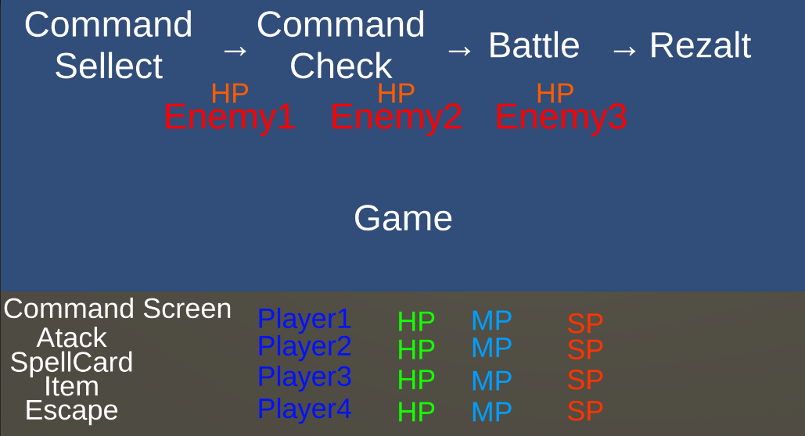

# Portfolio

- 齋藤 翔
- 連絡先 Email [chotosanae827@gmail.com](mailto:chotosanae827@gmail.com)
- 専門学校デジタルアーツ東京 ゲームプログラムコース 2023年卒業予定

## 資格
工事担任者試験　DD第三種 合格

## スキル
- C#
  - 利用歴1年
  - Visual Studioで簡単なゲームの作成ができる
- Unity
  - 利用歴1年
  - ミニゲームをある程度作ることができる
- C/C++
  - 利用歴3年
  - 簡易的なシステムプログラムの作成ができる
- cluster
  - 利用歴1年
  - テンプレートを用いて簡単なアトラクションを作れる
- python
  - 利用歴1年
  - データ管理プログラムを作ることができる

## 取り組んでいるテーマ
- Unityを用いてコマンドバトル式のRPGのシステム作成を試みる 
  主にターン制でFFの初代のような戦闘を再現し、
- 長い期間ゲームの制作をする、  期間は3ヶ月ほど行い自主的にプログラムをする習慣を身につける

## テーマの進捗状況
- モック画面の作成、予定処理順

[現状の仕様書](https://github.com/saitoukakeru0827/2022YearGameCreater/blob/main/Shiyou.md)

## 作品リスト
### Space Rabbit

作品概要

- 開発環境：Unity
- 開発期間：1週間

### 正の熟語

作品概要

- 開発環境：Unity
- 開発期間：1週間

### HOP!STEP!JUMP!

作品概要

- 開発環境：Unity
- 開発期間：２日間

## リンク
[unityroom choto827のページ](https://unityroom.com/users/9ulmc1sqyaojpx64dtfz) 
[企画書を作るときに参考にしたページ](https://www.byking.jp/blog/2019/06/28/%E8%8D%89%E6%A1%88%E6%9B%B8%E3%80%81%E4%BC%81%E7%94%BB%E6%9B%B8%E3%80%81%E4%BB%95%E6%A7%98%E6%9B%B8%E3%81%A3%E3%81%A6%E3%81%A9%E3%82%93%E3%81%AA%E3%83%A2%E3%83%8E%EF%BC%9F/) 
[参考にしたページを見ながら実際に試作したもの](https://unityroom.com/games/2d_shooting)

## 連絡先
- Email [chotosanae827@gmail.com](mailto:chotosanae827@gmail.com)
