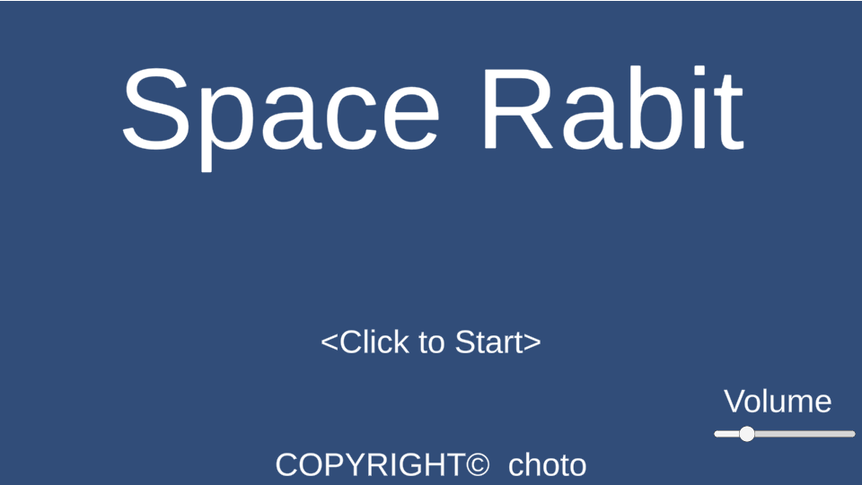
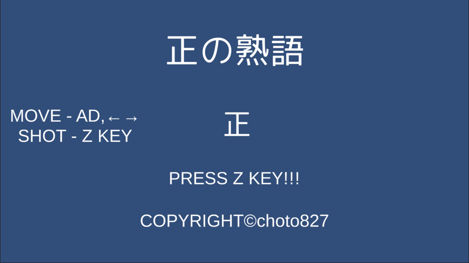
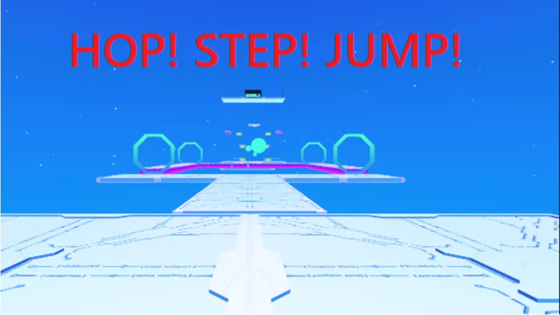

# Portfolio

- 齋藤 翔
- 連絡先 Email [chotosanae827@gmail.com](mailto:chotosanae827@gmail.com)
- 専門学校デジタルアーツ東京 ゲームプログラムコース 2023年卒業予定

## 資格
工事担任者試験　DD第三種 合格

## スキル
- C#
  - 利用歴1年
  - Visual Studioで簡単なゲームの作成ができる
- Unity
  - 利用歴1年
  - ミニゲームをある程度作ることができる
- C/C++
  - 利用歴3年
  - 簡易的なシステムプログラムの作成ができる
- cluster
  - 利用歴1年
  - テンプレートを用いて簡単なアトラクションを作れる
- python
  - 利用歴1年
  - データ管理プログラムを作ることができる

## 取り組んでいるテーマ
- Unityを用いてコマンドバトル式のRPGのシステム作成を試みる

## 作品リスト

### Space Rabbit

[SpaceRabbit](https://unityroom.com/games/space_rabbit)

作品概要

- 開発環境：Unity
- 開発期間：1週間

### 正の熟語

[正の熟語](https://unityroom.com/games/sei_choto)

作品概要

- 開発環境：Unity
- 開発期間：1週間

### HOP!STEP!JUMP!

[HOP!STEP!JUMP!](https://cluster.mu/w/f59915c6-b41e-4b7d-973b-7d5b239a33cd)

作品概要

- 開発環境：Unity
- 開発期間：２日間

## リンク
[unityroom choto827のページ](https://unityroom.com/users/9ulmc1sqyaojpx64dtfz)

## 連絡先
- Email [chotosanae827@gmail.com](mailto:chotosanae827@gmail.com)
